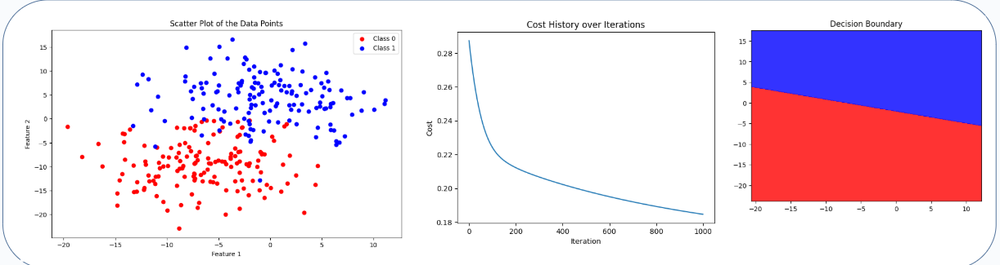
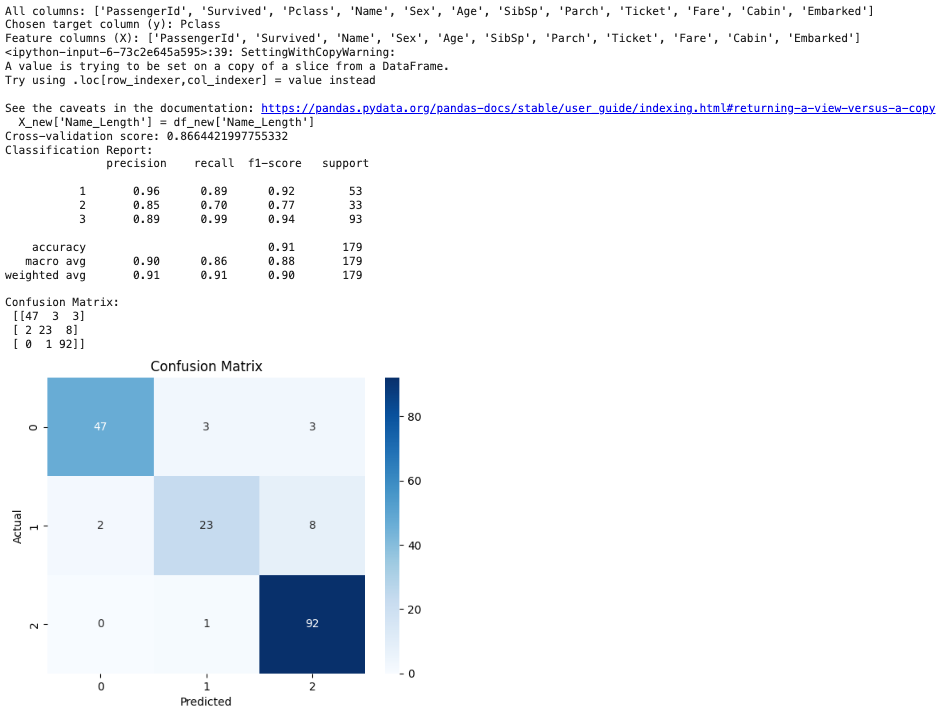
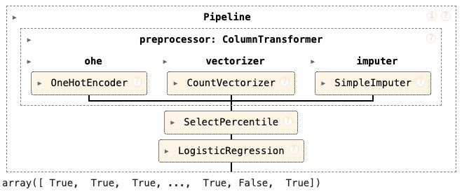

# Beginning ML Analytics

`_01_random_scatter_points_boundary_drawing.py` shows how to create random points, add on to data to rows or columns, and draw boundary between 2 clusters. 

## Framework for ML: Example Titanic Classification and Regression Analysis
_02_ and _03_ draws the Basic pattern that can be adapted to solve many ML problems:
- Data Loading
- Feature and Target Selection: Choose target variable and relevant features for the model.
- Data Preprocessing: Handle missing values, encode categorical variables, and scale numeric features.
- Model Training: Train a machine learning model using cross-validation.
- Model Evaluation: Evaluate the model's performance using accuracy, classification report, and confusion matrix.
- Visualization

`_02_framework_for_ML_example_titanic_classification_regression_Pclass_as_target_variable.py` demonstrates a machine learning pipeline for predicting passenger class (Pclass) on the Titanic dataset. The code covers data preprocessing, model training, evaluation, and visualization.
`_02a_framework_for_ML_example_titanic_classification_regression_Survived_as_target_variable.py` predicts target variable: `Survived`.

`_03_framework_for_ML_example_titanic_classification_regression.py` demonstrates a machine learning pipeline for predicting any variable target on the Titanic dataset. 

#### Files
`_02_framework_for_ML_example_titanic_classification_regression_Pclass_as_target_variable.py`

##### Description
- Data Loading: Load the Titanic dataset from a CSV file.
- Feature and Target Selection: Choose Pclass as the target variable and relevant features for the model. `_03_framework_for_ML_example_titanic_classification_regression.py` may use other target variable.
- Data Preprocessing: Handle missing values, encode categorical variables, and scale numeric features.
- Model Training: Train a machine learning model using cross-validation.
- Model Evaluation: Evaluate the model's performance using accuracy, classification report, and confusion matrix.
- Visualization: Visualize the model's performance and ROC curve (if applicable).

### Process Outline
- Load dataset
- Select columns
    - Randomly choose a column for y
    - Select N-1 columns for X (excluding the chosen y column)
- Load new data for prediction
- Handle text columns
- Set up preprocessing for numeric columns
- Set up preprocessing for categorical columns
- Select columns by data type
- Do all preprocessing
- Impute missing values in the target column if necessary
- Determine if the problem is classification or regression based on y
- Create a pipeline
- Cross-validate the pipeline
- Split the data for evaluation
- Fit the pipeline
- Make predictions
    - Plot confusion matrix
    - Plot ROC curve
    - Evaluate the regression model
    - Plot true vs predicted values

### Guidelines
- Assess all columns to have proper data types
- Assess data governance or management that include irrelevant or improper features (not targeting specific features, or omit data for privacy)
- Assess on how to handle text or date columns well (if it is text, may use count vectorizer then 1-hot; if it is date, date fields are to be preprocess insetad of direct 1-hot)
- Assess to include feature engineering
- Consider if Ordinal encoding may be better (ordered), or category for tree-based
- Consider if other imputation strategies may be better
- Consider if Numeric features may or may not need scaling
- Consider and assess if different model may be better

# [Under Construction]
Last updated: 2024-12-06_0251hr

