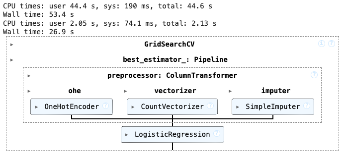

# Beginning ML Analytics

`_01_random_scatter_points_boundary_drawing.py` shows how to create random points, add on to data to rows or columns, and draw boundary between 2 clusters. 





## Hyperparameters:
Hyperparameters are the configuration settings or parameters of a machine learning model that are set before the model training begins and control how the model learns. These are different from model parameters, which are learned during the training process itself (e.g., weights in neural networks). Hyperparameters are crucial because they can significantly affect the performance of the model.

### Examples of hyperparameters:
- Learning Rate (in gradient descent): Controls how much to change the model's weights with respect to the loss gradient.
- Number of Trees (in Random Forest): Specifies how many decision trees should be in the ensemble.
- Depth of Trees (in decision trees): Specifies how deep the decision trees should grow.
- Penalty (in logistic regression or SVM): Determines the type of regularization (e.g., l1 for Lasso, l2 for Ridge).
- C (in logistic regression): Controls the trade-off between achieving a low training error and a low testing error (regularization strength).
- Number of Neighbors (in KNN): Determines how many neighbors should be considered when making a prediction.

These hyperparameters need to be set prior to training, and selecting the best ones can drastically improve the model's performance.

## Grid Search:
Grid Search is a technique used to systematically search through a predefined set of hyperparameters to find the combination that produces the best model performance. This is done by training and evaluating the model using all possible combinations of the hyperparameters in the grid.

Here’s how Grid Search works:
- Define a set of hyperparameters: You define the hyperparameters you want to tune and provide a set of values for each one. This set is referred to as a "grid."
- Train models for all possible combinations: Grid search evaluates the model's performance for every possible combination of these hyperparameters.
- Select the best combination: After evaluating all combinations, grid search selects the set of hyperparameters that resulted in the best performance, based on a metric (like accuracy, precision, etc.).
- Cross-validation: It often performs cross-validation during this process to ensure that the hyperparameter selection is not biased by a particular split of the data.

### Example of Grid Search in the Code:
The GridSearchCV function is used to find the best hyperparameters for the logistic regression model. Here's what the hyperparameter grid looks like:

```python
params = {
    'preprocessor__ohe__drop': [None, 'first'],
    'preprocessor__vectorizer__min_df': [1, 2, 3],
    'preprocessor__vectorizer__ngram_range': [(1, 1), (1, 2)],
    'classifier__C': [0.001, 0.01, 0.1, 1, 10, 100, 1000],
    'classifier__penalty': ['l1', 'l2']
}
```
- preprocessor__ohe__drop: Specifies whether to drop the first column during one-hot encoding (None or 'first').
- preprocessor__vectorizer__min_df: Sets the minimum frequency of words to be considered in the CountVectorizer.
- preprocessor__vectorizer__ngram_range: Defines the n-gram range, i.e., whether we should consider 1-grams (single words) or 2-grams (pairs of words).
- classifier__C: Specifies the regularization strength for logistic regression.
- classifier__penalty: Defines the type of regularization ('l1' or 'l2').

### How Grid Search works in this case:
- GridSearchCV will evaluate all combinations of these hyperparameters:
    - For example, it will first test with drop=None and min_df=1, and then check all other possible combinations like drop='first' with min_df=2, and so on.
- It will train the model on the data using each combination, compute the performance, and choose the one with the best result based on the selected evaluation metric (accuracy by default).

### Why use Grid Search?
- Efficiency: Grid search automates the process of hyperparameter tuning, saving time compared to manually trying each possible combination.
- Performance: By systematically testing all combinations, you are more likely to find the optimal settings for your model.
- Cross-validation: The use of cross-validation ensures that the performance estimate is not biased by any specific train-test split.

### Example Output:
If you run grid search, you will get output like:

```python
grid.best_params_  # Best hyperparameters found
grid.best_score_   # Best performance score (e.g., accuracy)
```

- Hyperparameters are predefined settings for your machine learning model that affect how it learns.
- Grid Search is a method for systematically testing different combinations of hyperparameters to find the best one for your model.

By using GridSearchCV, you can improve the performance of your model by selecting the most suitable hyperparameters automatically.


## Framework for ML: Example Titanic Classification and Regression Analysis
_02_ and _03_ draws the Basic pattern that can be adapted to solve many ML problems:
- Data Loading
- Feature and Target Selection: Choose target variable and relevant features for the model.
- Data Preprocessing: Handle missing values, encode categorical variables, and scale numeric features.
- Model Training: Train a machine learning model using cross-validation.
- Model Evaluation: Evaluate the model's performance using accuracy, classification report, and confusion matrix.
- Visualization

`_02_framework_for_ML_example_titanic_classification_regression_Pclass_as_target_variable.py` demonstrates a machine learning pipeline for predicting passenger class (Pclass) on the Titanic dataset. The code covers data preprocessing, model training, evaluation, and visualization.
`_02a_framework_for_ML_example_titanic_classification_regression_Survived_as_target_variable.py` predicts target variable: `Survived`.


`_03_framework_for_ML_example_titanic_classification_regression.py` demonstrates a machine learning pipeline for predicting any variable target on the Titanic dataset. 

#### Files
`_02_framework_for_ML_example_titanic_classification_regression_Pclass_as_target_variable.py`

##### Description
- Data Loading: Load the Titanic dataset from a CSV file.
- Feature and Target Selection: Choose Pclass as the target variable and relevant features for the model. `_03_framework_for_ML_example_titanic_classification_regression.py` may use other target variable.
- Data Preprocessing: Handle missing values, encode categorical variables, and scale numeric features.
- Model Training: Train a machine learning model using cross-validation.
- Model Evaluation: Evaluate the model's performance using accuracy, classification report, and confusion matrix.
- Visualization: Visualize the model's performance and ROC curve (if applicable).

### Process Outline
- Load dataset
- Select columns
    - Randomly choose a column for y
    - Select N-1 columns for X (excluding the chosen y column)
- Load new data for prediction
- Handle text columns
- Set up preprocessing for numeric columns
- Set up preprocessing for categorical columns
- Select columns by data type
- Do all preprocessing
- Impute missing values in the target column if necessary
- Determine if the problem is classification or regression based on y
- Create a pipeline
- Cross-validate the pipeline
- Split the data for evaluation
- Fit the pipeline
- Make predictions
    - Plot confusion matrix
    - Plot ROC curve
    - Evaluate the regression model
    - Plot true vs predicted values

### Guidelines
- Assess all columns to have proper data types
- Assess data governance or management that include irrelevant or improper features (not targeting specific features, or omit data for privacy)
- Assess on how to handle text or date columns well (if it is text, may use count vectorizer then 1-hot; if it is date, date fields are to be preprocess insetad of direct 1-hot)
- Assess to include feature engineering
- Consider if Ordinal encoding may be better (ordered), or category for tree-based
- Consider if other imputation strategies may be better
- Consider if Numeric features may or may not need scaling
- Consider and assess if different model may be better

# [Under Construction]
Last updated: 2024-12-06_0251hr

