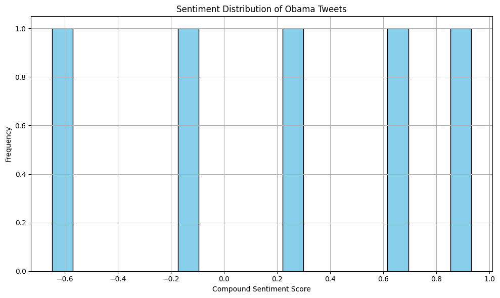
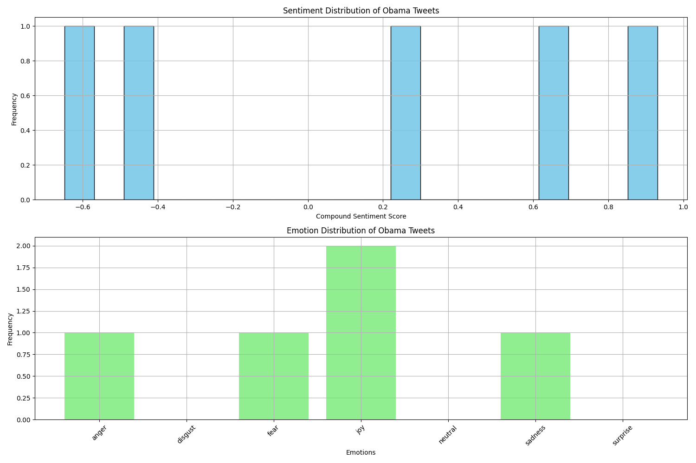
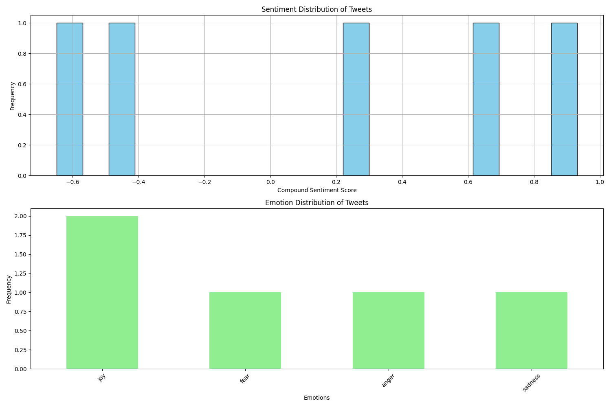

# Sentiment Analysis
### Preprocesses tweet text by:
- Lowercasing
- Tokenizing
- Removing stopwords
- Lemmatizing

### Performs sentiment analysis using NLTK's SentimentIntensityAnalyzer
- Calculates compound sentiment scores
- Categorizes tweets as Positive, Negative, or Neutral

### Performs emotion classification using a pre-trained RoBERTa model
- Classifies tweets into 7 emotions: anger, disgust, fear, joy, neutral, sadness, surprise

### Creates visualizations:
- Sentiment score distribution
- Emotion distribution

### Prints summary statistics of sentiment and emotion

